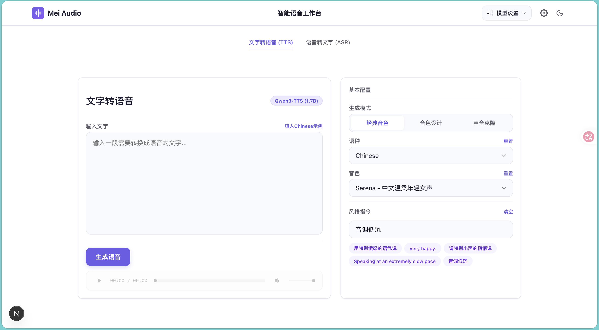
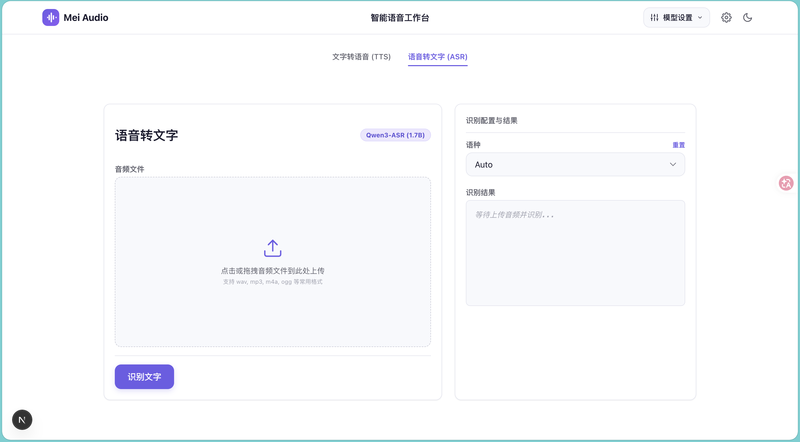

#  Mei Audio

极简、清爽的智能语音工作台，支持 **文字转语音 (TTS)** 与 **语音转文字 (ASR)** 极速合成与转写。

## 功能预览

### 1. 文字转语音 (TTS)
支持自定义风格指令（支持音调、情感、语速等多维控制）与音色描述，配有全自定义的精美音频播放器（播放、进度拖拽、音量与静音控制），采用常驻组件设计实现 **0 页面高度抖动**。



### 2. 语音转文字 (ASR)
支持直接点击或拖拽音频文件（wav, mp3, m4a, ogg 等）上传，并一键完成高精度文本识别。




## 安装与启动

项目已配置一键安装和启动脚本，会自动检查并安装所需的 Node 依赖及 Python 虚拟环境依赖，然后自动运行本地服务。

您只需在根目录执行以下**任意一个命令**即可完成全部安装与启动：

```bash
# 方式一：直接运行脚本
./start.sh

# 方式二：通过 npm 运行
npm run start-all
```

服务运行后，默认访问地址：
* 前端页面：`http://localhost:3000`
* 转发服务：`http://127.0.0.1:8001`

如需停止服务，直接在终端按 `Ctrl+C`，脚本会自动退出并安全释放后台 Python 服务端口。


## 构建

```bash
npm run build
```

## 目录结构

```text
audio-toggle-text/
├── app/                    # Next.js 页面和 API
│   ├── api/
│   │   ├── speech-to-text/
│   │   └── text-to-speech/
│   ├── globals.css
│   ├── layout.tsx
│   └── page.tsx
├── components/             # 页面面板组件
│   ├── asr-panel.tsx
│   └── qwen-tts-panel.tsx
├── hooks/
│   └── use-audio-recorder.ts
├── lib/
│   ├── client/             # 前端常量和小工具
│   └── server/             # 后端音频、进程、Python 服务调用
├── output/                 # 本地生成和上传的临时音频
├── scripts/
│   └── qwen_service.py     # 本地 Python HTTP 服务
├── services/
│   ├── qwen-asr/           # Qwen ASR Python 运行环境、依赖和转写脚本
│   └── qwen-tts/           # Qwen TTS Python 运行环境和合成脚本
├── package.json
├── next.config.ts
└── tsconfig.json
```

## 语音模型调研与对比

### 1. Qwen3-TTS-12Hz-1.7B 系列模型
阿里开源的最新 TTS 语音合成系列模型（1.7B / 0.6B 参数），具备极高的拟真度与低延迟。其主要分为以下三个版本：

*   **Qwen3-TTS-12Hz-1.7B-VoiceDesign**
    *   **作用**：根据文字描述创造音色。
    *   **示例**：输入“一个年轻女声，温柔、慢速、有亲和力”，模型按描述生成契合的声音。
    *   **适合场景**：个性化、自定义的新音色生成。
*   **Qwen3-TTS-12Hz-1.7B-CustomVoice**
    *   **作用**：使用内置的 9 个精品音色，并可以通过提示词指令控制声音的情绪和风格。
    *   **示例**：选择预设音色 `Serena`，并加入指令“开心一点”或“冷静分析”以改变语调。
    *   **适合场景**：效果最稳定，最容易落地。**当前项目已采用该路线。**
*   **Qwen3-TTS-12Hz-1.7B-Base**
    *   **作用**：基础模型。支持使用 3 秒音频做 Zero-shot 声音克隆，亦可用于微调到其他子模型。
    *   **适合场景**：技术研究、声音克隆和二次开发，不适合直接做产品 Demo。

---

### 2. 行业主流语音模型盘点与纠偏
在前期调研的基础上，我们对主流语音模型进行了重新核对与梳理，纠正了部分分类误区（例如：部分文字转语音模型曾被误归为语音转文字模型）：

#### ▍ 文字转语音模型 (TTS, Text-to-Speech)
这部分模型的作用是将**文字**合成为**语音**。
*   **开源/本地部署级**：
    *   **GPT-SoVITS**：目前非常流行的 Zero-shot 语音克隆与 TTS 框架，中文效果出色。
    *   **CosyVoice 2.0**：阿里开源的优秀 TTS 模型，支持多语言、多音色克隆及情绪控制。
    *   **Fish-speech**：基于 VQ-GAN 和 LLM 架构的多语言 TTS 模型。
    *   **F5-TTS**：非自回归的 TTS 模型，推理速度快，效果自然。
    *   **IndexTTS 2.4 / IndexTTS2**：Bilibili 开源的工业级 Zero-shot TTS 系统。被广泛评为开源界“效果天花板”之一，核心优势在于**情感与音色完全解耦**（换情绪不丢音色）和**毫秒级精准时长控制**，其合成细腻度被不少网友认为可媲美 ElevenLabs 等顶级闭源商业模型。
    *   **VoxCPM**：多语种语音合成模型。
    *   **OmniVoice**：多语种零样本 TTS 模型，支持数百种语言。
    *   **LongCat AudioDiT**：美团开源的基于 Diffusion 架构的 SOTA 级别 TTS 模型，直接在波形潜空间生成高保真音频。
    *   **Fish Audio S2 Pro**：Fish Audio 的双自回归（Dual-AR）架构 TTS 模型，具备极致的情感表达与超低延迟。
*   **工具与接口级**：
    *   **Edge-tts**（原误分到 ASR）：免费的工具级 TTS，直接调用微软 Edge 浏览器的 Read Aloud 网页端接口，发音极为自然，无需本地显卡，极易落地。
    *   **MiniMax 商业模型**（原误分到 ASR）：闭源 API，其 TTS（语音合成）在行业里以极强的语气词、呼吸声和高拟人度著称，同时也提供双向通话能力。

#### ▍ 语音转文字模型 (ASR/STT, Speech-to-Text / Automatic Speech Recognition)
这部分模型的作用是将**语音**转写为**文字**。
*   **Whisper 系列** (OpenAI)：目前全球最流行、多语言支持最强的开源 ASR 模型。在 macOS 上通过 `whisper.cpp` 或 `faster-whisper` 可以流畅地运行。
*   **SenseVoice** (阿里)：专为多语言语音识别和情绪/声音事件检测设计的极速 ASR 模型，推理速度极快，对中文支持极好。
*   **Paraformer / FunASR** (阿里)：非常成熟的中文 ASR 框架，适合本地化运行。

---

### 3. Mac (Apple Silicon) 本地运行可行性分析
在 Mac 设备（如 M1/M2/M3 芯片）本地测试中，很多效果优秀的 TTS 模型常常难以顺利跑通，其主要技术原因与 Qwen3-TTS 的优势如下：

1.  **复杂的 GPU/CUDA 依赖**：
    像 `GPT-SoVITS`, `CosyVoice 2.0`, `F5-TTS`, `IndexTTS2` 等模型，在设计时深度依赖 Linux/Windows 环境下的 CUDA 驱动、Triton 编译器或 FlashAttention 算子。在 macOS 下（即使有 PyTorch MPS 支持），由于部分高级算子在 MPS 上未实现或编译链断裂，经常会导致 `pip install` 编译失败，或在运行时加载模型时报错崩溃。
2.  **Edge-tts 的轻量替代性**：
    如果不需要完全离线，**Edge-tts** 可以在 Mac 上一键跑通，因为它只通过 HTTP/WebSocket 请求微软的免费合成接口，是本地开发 Demo 的极佳平替方案。
3.  **Qwen3-TTS 的高兼容性**：
    **Qwen3-TTS**（尤其是 1.7B 和 0.6B 版本）得益于其轻量化的架构和对标准 `transformers` 库的友好支持，不需要编译复杂的 CUDA 独占算子。在 Mac 下通过 PyTorch 的 CPU 或 MPS 加速，可以实现“一键安装依赖并拉起”，是当前 Mac 本地离线部署最稳定、最容易成功运行的 SOTA 级别模型。
